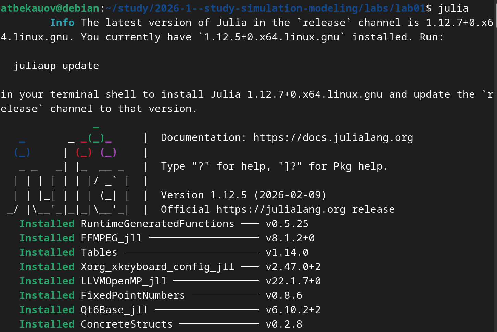
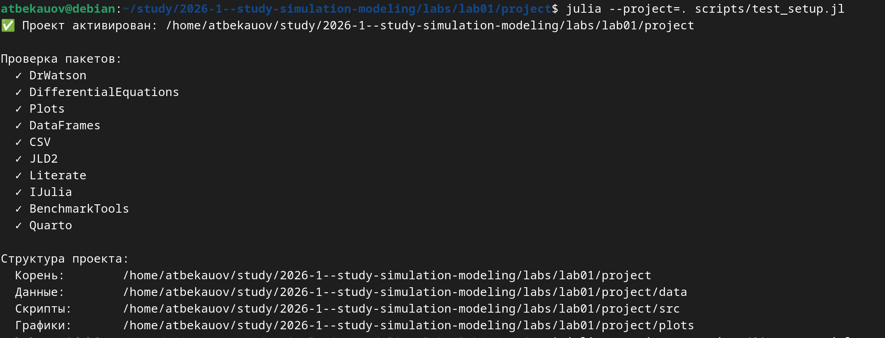
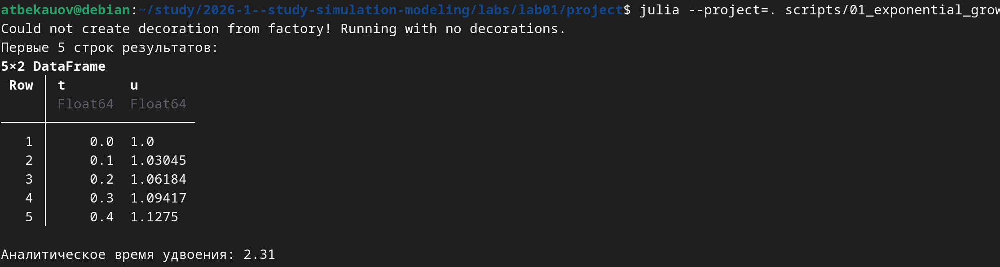
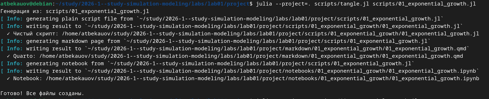
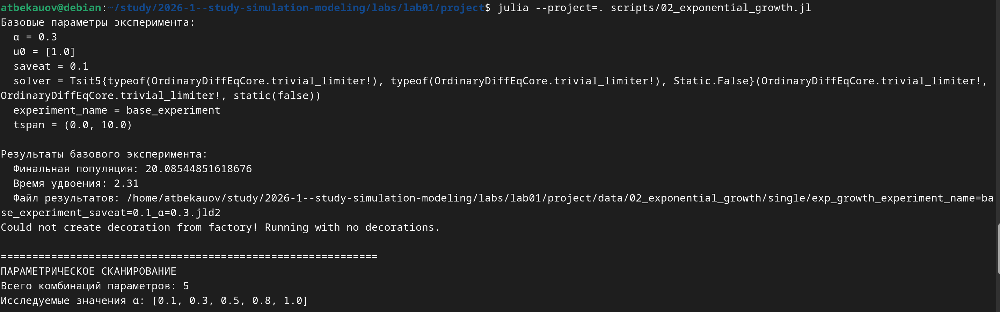
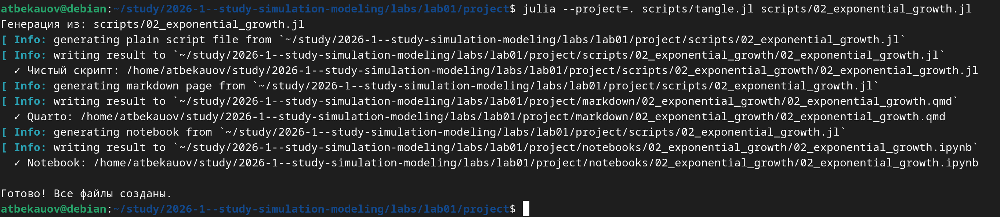

---
## Author
author:
  name: Бекауов Артур Тимурович
  email: 1132236049@rudn.ru

## Title
title: "Лабораторная работа №1: Подготовка стенда и модель экспоненциального роста"
subtitle: "Имитационное моделирование"
license: "CC BY"
---

# Цель работы

Освоить практические навыки настройки рабочего окружения для имитационного моделирования: работа с Git, GPG-подпись коммитов, организация проекта с помощью DrWatson, реализация модели экспоненциального роста в литературном стиле.

# Задание

1. Создать рабочий каталог для курса
2. Инициализировать Git Flow и создать первый релиз v1.0.0
3. Создать проект DrWatson и установить необходимые пакеты
4. Реализовать модель экспоненциального роста
5. Преобровать код в Литературный стиль
6. Выполнить параметрическое исследование модели


# Теоретическое введение

Модель экспоненциального роста описывается дифференциальным уравнением:

$$ \frac{du}{dt} = \alpha u $$

где $u$ — текущее значение величины, $t$ — время, $\alpha$ — константа скорости роста.

Решение уравнения: $u(t) = u_0 e^{\alpha t}$, где $u_0$ — начальное значение.

Время удвоения: T(1/2) = ln(2)/$\alpha$

# Выполнение лабораторной работы

## 1. Создание рабочего каталога курса

С помощью следующих команд скопирум на устройство репозиторий, создадим ему структуру соответствующую курсу по имитационному моделированию и сделаем первый коммит.

```bash
mkdir -p ~/work/study/2026-1/
cd ~/work/study/2026-1/
git clone ssh://git@gitverse.ru:2222/gleb/2026-1--study--simulation-modeling.git
cd 2026-1--study--simulation-modeling
echo simulation-modeling > COURSE
make prepare
git add .
git commit -am 'feat(main): make course structure'
git push
```

## 2. Инициализация Git Flow и создание релиза

С помощью следующих команд инициализируем Git-flow и создадим первый релиз 1.0.0

```bash
git flow init -d
git flow release start 1.0.0
sudo npm install -g standard-version
standard-changelog --first-release
git add CHANGELOG.md
git commit -m "chore: add changelog for release 1.0.0"
git flow release finish 1.0.0
git push --all
git push --tags
```

## 3 Создания проекта DrWatson

С помощью следующих команд инициализируем проект DrWatson

```bash
cd labs/lab01
julia
```

```julia
using Pkg
Pkg.add("DrWatson")
using DrWatson
initialize_project("project"; authors="Бекауов Артур", git=false)
```

Далее установим необходимые для выполнения лабораторной работы пакеты ([рис. @fig-001]).

{#fig-001 width=70%}

Затем с помощью скрипта test_setup.jl со следующим листингом, проверим наличие необходимых пакетов ([рис. @fig-002]).

```julia
##!/usr/bin/env julia
## test_setup.jl

using DrWatson
@quickactivate "project"

println("✅ Проект активирован: ", projectdir())

## Проверка пакетов
packages = [
    "DrWatson",           # Организация проекта
    "DifferentialEquations",  # Решение ОДУ
    "Plots",              # Визуализация
    "DataFrames",         # Таблицы данных
    "CSV",                # Работа с CSV
    "JLD2",               # Сохранение данных
    "Literate",           # Literate programming
    "IJulia",             # Jupyter notebook
    "BenchmarkTools",     # Бенчмаркинг
    "Quarto"              # Создание отчетов
]

println("\nПроверка пакетов:")
for pkg in packages
    try
        eval(Meta.parse("using $pkg"))
        println("  ✓ $pkg")
    catch e
        println("  ✗ $pkg: Ошибка загрузки")
    end
end

## Проверка путей
println("\nСтруктура проекта:")
println("  Корень:        ", projectdir())
println("  Данные:        ", datadir())
println("  Скрипты:       ", srcdir())
println("  Графики:       ", plotsdir())
```

{#fig-002 width=70%}

## 4. Реализация модели экспаненциального роста

Создадим скрипт 01_exponential_growth.jl со следующим листингом:

```julia
using DrWatson
@quickactivate "project"

using DifferentialEquations
using Plots
using DataFrames

function exponential_growth!(du, u, p, t)
    α = p
    du[1] = α * u[1]
end

u0 = [1.0]          # начальная популяция
α = 0.3            # скорость роста
tspan = (0.0, 10.0) # временной интервал

prob = ODEProblem(exponential_growth!, u0, tspan, α)
sol = solve(prob, Tsit5(), saveat=0.1)

plot(sol, label="u(t)", xlabel="Время t", ylabel="Популяция u",
     title="Экспоненциальный рост (α = $α)", lw=2, legend=:topleft)

savefig(plotsdir("exponential_growth_α=$α.png"))

df = DataFrame(t=sol.t, u=first.(sol.u))
println("Первые 5 строк результатов:")
println(first(df, 5))

u_final = last(sol.u)[1]
doubling_time = log(2) / α
println("\nАналитическое время удвоения: ", round(doubling_time; digits=2))
```

и выполним его ([рис. @fig-003])

{#fig-003 width=70%}

## 5. Литературный стиль и производные форматы

Перепишем скрипт 01_exponential_growth.jl в стиле литературного программирования со следующим листингом: 

```julia
# # Экспоненциальный рост
# **Цель:** Исследовать решение уравнения $du/dt = αu$.
#
# ## Инициализация проекта и загрузка пакетов
using DrWatson
@quickactivate "project"

using DifferentialEquations
using Plots
using DataFrames
using JLD2

script_name = splitext(basename(PROGRAM_FILE))[1]
mkpath(plotsdir(script_name))
mkpath(datadir(script_name))

# ## Определение модели
# Уравнение экспоненциального роста:
# $\frac{du}{dt} = α u, \quad u(0) = u_0$

function exponential_growth!(du, u, p, t)
    α = p
    du[1] = α * u[1]
end

# ## Первый запуск с параметрами по умолчанию
# Зададим начальные параметры:
u0 = [1.0]          # начальная популяция
α = 0.3            # скорость роста
tspan = (0.0, 10.0) # временной интервал

prob = ODEProblem(exponential_growth!, u0, tspan, α)
sol = solve(prob, Tsit5(), saveat=0.1)

# ## Визуализация результатов
# Построим график решения:
plot(sol, label="u(t)", xlabel="Время t", ylabel="Популяция u",
     title="Экспоненциальный рост (α = $α)", lw=2, legend=:topleft)

# Сохраним график в папку plots
savefig(plotsdir(script_name, "exponential_growth_α=$α.png"))

# ## Анализ результатов
# Создадим таблицу с данными:
df = DataFrame(t=sol.t, u=first.(sol.u))
println("Первые 5 строк результатов:")
println(first(df, 5))

# Вычислим удвоение популяции:
u_final = last(sol.u)[1]
doubling_time = log(2) / α
println("\nАналитическое время удвоения: ", round(doubling_time; digits=2))

# ## Сохранение всех результатов
@save datadir(script_name, "all_results.jld2") df
```

, выполним его и с помощью скрипта tangle.jl c листингом

```julia
using DrWatson
@quickactivate  # Активирует текущий проект DrWatson

using Literate

function main()
    if length(ARGS) == 0
        println("""
        Использование: julia tangle.jl <путь_к_скрипту>

        Примеры:
          julia tangle.jl scripts/lab1.jl
        """)
        return
    end

    script_path = ARGS[1]

    if !isfile(script_path)
        error("Файл не найден: $script_path")
    end

    # Пути и имена
    script_dir = dirname(script_path)
    script_name = splitext(basename(script_path))[1]

    println("Генерация из: $script_path")

    # Чистый скрипт (без комментариев)
    scripts_dir = scriptsdir(script_name)
    Literate.script(script_path, scripts_dir; credit=false)
    println("  ✓ Чистый скрипт: $(scripts_dir)/$(script_name).jl")

    # Quarto-документ
    quarto_dir = projectdir("markdown", script_name);
    Literate.markdown(script_path, quarto_dir;
                      flavor=Literate.QuartoFlavor(),
                      name=script_name, credit=false)

    println("  ✓ Quarto: $(quarto_dir)/$(script_name).qmd")

    # Jupyter notebook
    notebooks_dir = projectdir("notebooks", script_name)
    Literate.notebook(script_path, notebooks_dir, name=script_name; execute=false, credit=false)
    println("  ✓ Notebook: $(notebooks_dir)/$(script_name).ipynb")

    println("\nГотово! Все файлы созданы.")
end

# Запуск
if abspath(PROGRAM_FILE) == @__FILE__
    main()
end
```

, создадим производные форматы от скрипта 01_exponential growth.jl (чистый скрипт, jupyter-notebook, quarto-документ) ([рис. @fig-004]).

{#fig-004 width=70%}


## 6. Параметрическое исследование

Создадим скрипт 02_exponential_growth.jl с листингом:

```julia
# # Параметрическое исследование экспоненциального роста
#
# ## Активация проекта и загрузка пакетов
#
# **ИЗМЕНЕНИЕ:** Добавлен DrWatson для управления проектом и параметрами

using DrWatson
@quickactivate "project"  # Активация проекта DrWatson

using DifferentialEquations
using DataFrames
using Plots
using JLD2
using BenchmarkTools

# Установка каталогов
script_name = splitext(basename(PROGRAM_FILE))[1]
mkpath(plotsdir(script_name))
mkpath(datadir(script_name))

# ## Определение модели
# Модель: $du/dt = α \cdot u$

function exponential_growth!(du, u, p, t)
    α = p.α  # **ИЗМЕНЕНИЕ:** Параметры теперь передаются как именованный кортеж
    du[1] = α * u[1]
end

# ## Определение параметров в Dict
# **ОСНОВНОЕ ИЗМЕНЕНИЕ:** Все параметры собраны в Dict для систематизации

# Базовый набор параметров (один эксперимент)
base_params = Dict(
    :u0 => [1.0],           # начальная популяция
    :α => 0.3,              # скорость роста
    :tspan => (0.0, 10.0),  # интервал времени
    :solver => Tsit5(),     # метод решения
    :saveat => 0.1,         # шаг сохранения результатов
    :experiment_name => "base_experiment"
)

println("Базовые параметры эксперимента:")
for (key, value) in base_params
    println("  $key = $value")
end

# ## Функция-обертка для запуска одного эксперимента
# **ИСПРАВЛЕНИЕ:** Возвращаем Dict со строковыми ключами

function run_single_experiment(params::Dict)
    @unpack u0, α, tspan, solver, saveat = params
    prob = ODEProblem(exponential_growth!, u0, tspan, (α=α,)) # Создаем и решаем задачу
    sol = solve(prob, solver; saveat=saveat)
    final_population = last(sol.u)[1] # Анализ результатов
    doubling_time = log(2) / α
    return Dict(
        "solution" => sol,
        "time_points" => sol.t,
        "population_values" => first.(sol.u),
        "final_population" => final_population,
        "doubling_time" => doubling_time,
        "parameters" => params  # Сохраняем исходные параметры
    ) # Используем строки как ключи для совместимости с DrWatson
end

# ## Запуск базового эксперимента
# **ИЗМЕНЕНИЕ:** Используем produce_or_load для автоматического кэширования

data, path = produce_or_load(
    datadir(script_name, "single"),      # Папка для сохранения
    base_params,            # Параметры эксперимента
    run_single_experiment,  # Функция для выполнения
    prefix = "exp_growth",  # Префикс имени файла
    tag = false,            # Не добавлять git-тег
    verbose = true
)

println("\nРезультаты базового эксперимента:")
println("  Финальная популяция: ", data["final_population"])
println("  Время удвоения: ", round(data["doubling_time"]; digits=2))
println("  Файл результатов: ", path)

# ## Визуализация базового эксперимента

p1 = plot(data["time_points"], data["population_values"],
    label="α = $(base_params[:α])",
    xlabel="Время, t",
    ylabel="Популяция, u(t)",
    title="Экспоненциальный рост (базовый эксперимент)",
    lw=2,
    legend=:topleft,
    grid=true
)

# Сохраним график в папку plots
savefig(plotsdir(script_name, "single_experiment.png"))

# ## Параметрическое сканирование
# **НОВАЯ СЕКЦИЯ:** Исследование влияния параметра α

# Сетка параметров для сканирования
param_grid = Dict(
    :u0 => [[1.0]],           # фиксируем начальное условие
    :α => [0.1, 0.3, 0.5, 0.8, 1.0],  # исследуемые значения скорости роста
    :tspan => [(0.0, 10.0)],  # фиксируем интервал времени
    :solver => [Tsit5()],     # фиксируем метод решения
    :saveat => [0.1],         # фиксируем шаг сохранения
    :experiment_name => ["parametric_scan"]
)

# Генерация всех комбинаций параметров
all_params = dict_list(param_grid)

println("\n" * "="^60)
println("ПАРАМЕТРИЧЕСКОЕ СКАНИРОВАНИЕ")
println("Всего комбинаций параметров: ", length(all_params))
println("Исследуемые значения α: ", param_grid[:α])
println("="^60)

# ## Запуск всех экспериментов и собор результатов
# **НОВАЯ СЕКЦИЯ:** Автоматический запуск и сохранение всех вариантов

all_results = []
all_dfs = []

for (i, params) in enumerate(all_params)
    println("Прогресс: $i/$(length(all_params)) | α = $(params[:α])")

    data, path = produce_or_load(
        datadir(script_name, "parametric_scan"),  # Данные
        params,                      # Текущий набор параметров
        run_single_experiment,       # Функция для выполнения
        prefix = "scan",             # Префикс имени файла
        tag = false,
        verbose = false              # Не выводить подробности для каждого запуска
    ) # Автоматическое сохранение/загрузка каждого эксперимента

    result_summary = merge(
        params,
        Dict(
            :final_population => data["final_population"],
            :doubling_time => data["doubling_time"],
            :filepath => path  # Путь к сохраненным данным
        )
    ) # Сохраняем сводные результаты (используем символы для параметров, но данные из data - строки)

    push!(all_results, result_summary)

    df = DataFrame(
        t = data["time_points"],
        u = data["population_values"],
        α = fill(params[:α], length(data["time_points"]))
    ) # Сохраняем полные данные для визуализации
    push!(all_dfs, df)
end

# ## Анализ и визуализация результатов сканирования
# **НОВАЯ СЕКЦИЯ:** Сравнительный анализ всех экспериментов

# Сводная таблица результатов
results_df = DataFrame(all_results)
println("\nСводная таблица результатов:")
println(results_df[!, [:α, :final_population, :doubling_time]])

# Сравнительный график всех траекторий
p2 = plot(size=(800, 500), dpi=150)

for params in all_params

    data, _ = produce_or_load(
        datadir(script_name, "parametric_scan"),
        params,
        run_single_experiment,
        prefix = "scan"
    ) # Загружаем данные (они уже есть на диске)

    plot!(p2, data["time_points"], data["population_values"],
        label="α = $(params[:α])",
        lw=2,
        alpha=0.8
    )
end

plot!(p2,
    xlabel="Время, t",
    ylabel="Популяция, u(t)",
    title="Параметрическое исследование: влияние α на рост",
    legend=:topleft,
    grid=true
)

# Сохраним график в папку plots
savefig(plotsdir(script_name, "parametric_scan_comparison.png"))

# График зависимости времени удвоения от α
p3 = plot(results_df.α, results_df.doubling_time,
    seriestype=:scatter,
    label="Численное решение",
    xlabel="Скорость роста, α",
    ylabel="Время удвоения, t₂",
    title="Зависимость времени удвоения от α",
    markersize=8,
    markercolor=:red,
    legend=:topright
)

# Теоретическая кривая: t₂ = ln(2)/α
α_range = 0.1:0.01:1.0

plot!(p3, α_range, log(2) ./ α_range,
    label="Теория: t₂ = ln(2)/α",
    lw=2,
    linestyle=:dash,
    linecolor=:blue
)

# Сохраним график в папку plots
savefig(plotsdir(script_name, "doubling_time_vs_alpha.png"))

# ## Бенчмаркинг с разными параметрами
# **ИЗМЕНЕНИЕ:** Бенчмаркинг для разных значений α

println("\n" * "="^60)
println("Бенчмаркинг для разных значений α")
println("="^60)

benchmark_results = []
for α_value in param_grid[:α]

    bench_params = Dict(
        :u0 => [1.0],
        :α => α_value,
        :tspan => (0.0, 10.0),
        :solver => Tsit5(),
        :saveat => 0.1
    ) # Подготавливаем параметры для бенчмарка

    function benchmark_run() # Функция для бенчмарка
        prob = ODEProblem(exponential_growth!,
                         bench_params[:u0],
                         bench_params[:tspan],
                         (α=bench_params[:α],))
        return solve(prob, bench_params[:solver];
                     saveat=bench_params[:saveat])
    end

    println("\nБенчмарк для α = $α_value:")
    b = @benchmark $benchmark_run() samples=100 evals=1 # Запуск бенчмарка
    push!(benchmark_results, (α=α_value, time=median(b).time/1e9))  # время в секундах

    println("  Среднее время: ", round(median(b).time/1e9; digits=4), " сек")
end

# График зависимости времени вычисления от α
bench_df = DataFrame(benchmark_results)
p4 = plot(bench_df.α, bench_df.time,
    seriestype=:scatter,
    label="Время вычисления",
    xlabel="Скорость роста, α",
    ylabel="Время вычисления, сек",
    title="Зависимость времени вычисления от α",
    markersize=8,
    markercolor=:green,
    legend=:topleft
)

# Сохраним график в папку plots
savefig(plotsdir(script_name, "computation_time_vs_alpha.png"))

# ## Сохранение всех результатов
# **НОВАЯ СЕКЦИЯ:** Сохранение сводных данных для последующего анализа
@save datadir(script_name, "all_results.jld2") base_params param_grid all_params results_df bench_df

@save datadir(script_name, "all_plots.jld2") p1 p2 p3 p4

println("\n" * "="^60)
println("ЛАБОРАТОРНАЯ РАБОТА ЗАВЕРШЕНА")
println("="^60)
println("\nРезультаты сохранены в:")
println("  • data/$(script_name)/single/              - базовый эксперимент")
println("  • data/$(script_name)/parametric_scan/     - параметрическое сканирование")
println("  • data/$(script_name)/all_results.jld2     - сводные данные")
println("  • plots/$(script_name)/                    - все графики")
println("  • data/$(script_name)/all_plots.jld2      - объекты графиков")
println("\nДля анализа результатов используйте:")
println("  using JLD2, DataFrames")
println("  @load \"data/$(script_name)/all_results.jld2\"")
println("  println(results_df)")
```

Выполним этот скрипт ([рис. @fig-005]).

{#fig-005 width=70%}

Далее создадим из него производные форматы ([рис. @fig-006]).

{#fig-006 width=70%}







# Выводы

В ходе лабораторной работы я освоил практические навыки настройки рабочего окружения для имитационного моделирования: работа с Git, GPG-подпись коммитов, организация проекта с помощью DrWatson, реализация модели экспоненциального роста в литературном стиле.

# Список литературы{.unnumbered}

::: {#refs}


