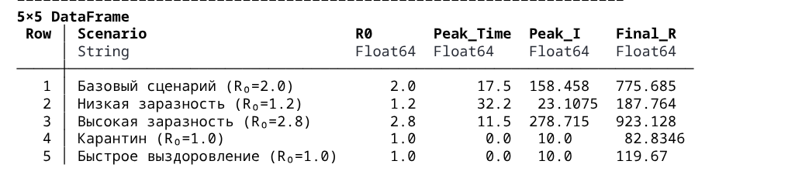
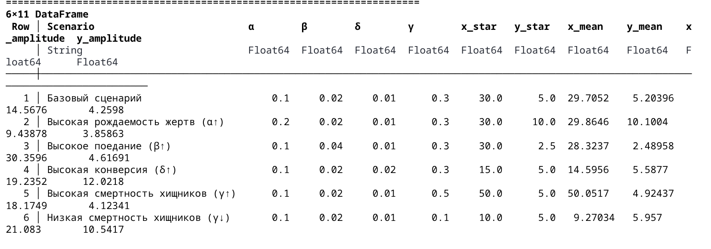

---
## Author
author:
  name: Бекауов Артур Тимурович
  degrees: student
  email: 1132236049@rudn.ru
  affiliation:
    - name: Российский университет дружбы народов
      country: Российская Федерация
      postal-code: 117198
      city: Москва
      address: ул. Миклухо-Маклая, д. 6
## Title
title: Лабораторная работа №2
subtitle: Модели SIR и Лотки-Вольтерры
license: CC BY
date: today
date-format: "YYYY-MM-DD" # Example: 2025-09-06
---

# Информация

## Докладчик

:::::::::::::: {.columns align=center}
::: {.column width="70%"}

  * Бекауов Артур Тимурович
  * студент НФИбд-01-23
  * Российский университет дружбы народов им. П. Лумумбы
  * [1132236049@rudn.ru](mailto:1132236049@rudn.ru)

:::
::: {.column width="30%"}

:::
::::::::::::::

# Вводная часть

## Актуальность

Модель SIR есть классическая и фундаментальная математическая модель эпидемиологии, описывающая распространение инфекционного заболевания в закрытой популяции.

Модель Лотки-Вольтерры демонстрирует, как даже простая система взаимодействий может порождать сложные колебательные режимы, объясняя циклические изменения численности в природных экосистемах.

## Объект и предмет исследования

- Объект: процесс имитационного моделирования
- Предмет: модель SIR, модель Лотки-Волтерры
- Инструменты: DrWatson и Julia

## Цели и задачи

Изучить две модели: модель SIR, модель Лотки-Вольтерры

## Материалы и методы

- Язык программирования Julia
- Пакеты: DifferentialEquations.jl, Plots.jl, DrWatson.jl
- Literate.jl для литературного программирования
- Quarto для генерации отчётов

# Выполнение лабораторной работы

## Создание проекта DrWatson

- Создан проект DrWatson в каталоге labs/lab01
- Установлены необходимые пакеты для моделирования
- Проверена работоспособность окружения

## Установлены пакеты

- DrWatson
- DifferentialEquations
- Plots
- DataFrames 
- Literate 
- IJulia 
- Quarto 
- CSV
- BenchmarkTools
- StatsPlots
- Tables

## Модель SIR

Выполняю скрипт sir_ode.jl, преобразую в литературный стиль, создаю производные форматы и выполняю jupyter notebook

## Модель SIR с параметрами 

Добавляю в код в литературном стиле вычисление для набора параметров, получая скрипт sir_ode_param.jl, преобразую в литературный стиль, создаю производные форматы и выполняю jupyter notebook

## Результаты параметрического исследования

{#fig-001 width=70%}

## Анализ результатов (1/2)

На основе полученных результатов можно сделать следующие выводы:

1. **Влияние β (вероятности заражения):**
   - Увеличение β с 0.03 до 0.07 повышает R₀ с 1.2 до 2.8
   - Пик эпидемии становится выше и наступает раньше
   - Итоговое число переболевших значительно возрастает

2. **Влияние c (числа контактов):**
   - Снижение c с 10 до 5 (карантин) уменьшает R₀ с 2.0 до 1.0
   - При R₀=1.0 эпидемия не развивается (стабильное состояние)

## Анализ результатов (1/2)

3. **Влияние γ (скорости выздоровления):**
   - Увеличение γ с 0.25 до 0.5 (более быстрое выздоровление)
   - Снижает R₀ с 2.0 до 1.0
   - Укорачивает продолжительность эпидемии

4. **Порог коллективного иммунитета:**
   - Для базового сценария (R₀=2.0): 1 - 1/R₀ = 50%
   - Фактическая доля переболевших близка к этому значению

## Модель Лотки-Вольтерры

Выполняю скрипт lv_ode.jl, преобразую в литературный стиль, создаю производные форматы и выполняю jupyter notebook

## Модель Лотки-Вольтерры с параметрами

Добавляю в код в литературном стиле вычисление для набора параметров, получая скрипт lv_ode_param.jl, преобразую в литературный стиль, создаю производные форматы и выполняю jupyter notebook

## Результаты параметрического исследования

{#fig-002 width=70%}

## Анализ результатов (1/2)

На основе полученных результатов можно сделать следующие выводы:

1. **Влияние α (рождаемости жертв):**
   - Увеличение α повышает равновесную численность хищников y*
   - Амплитуда колебаний возрастает
   - Частота колебаний увеличивается (период уменьшается)

2. **Влияние β (поедания жертв):**
   - Увеличение β снижает равновесную численность хищников y*
   - Амплитуда колебаний жертв возрастает
   - Система становится менее устойчивой

## Анализ результатов (1/2)

3. **Влияние δ (конверсии):**
   - Увеличение δ снижает равновесную численность жертв x*
   - Повышает эффективность размножения хищников
   - Увеличивает амплитуду колебаний хищников

4. **Влияние γ (смертности хищников):**
   - Увеличение γ повышает равновесную численность жертв x*
   - Снижает амплитуду колебаний обоих видов
   - При высоких γ хищники могут вымереть

5. **Фазовый сдвиг:**
   - Во всех сценариях сохраняется характерный сдвиг фаз
   - Пик хищников отстает от пика жертв примерно на 1/4 периода

# Результаты

## Полученные результаты

- Реализованы модели SIR и Лотки-Вольтерры
- Выполнено параметрическое исследование
- Сгенерированы Jupyter блокнот и документация Quarto

