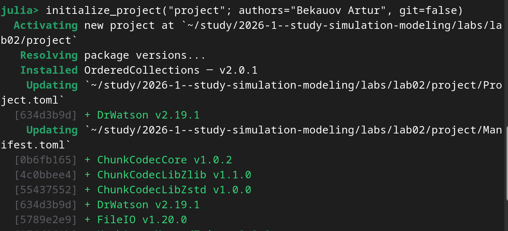
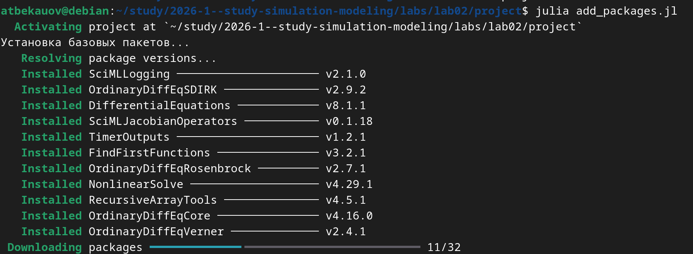
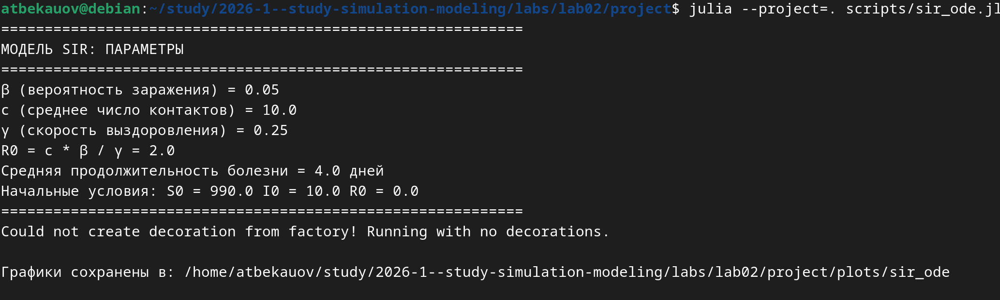
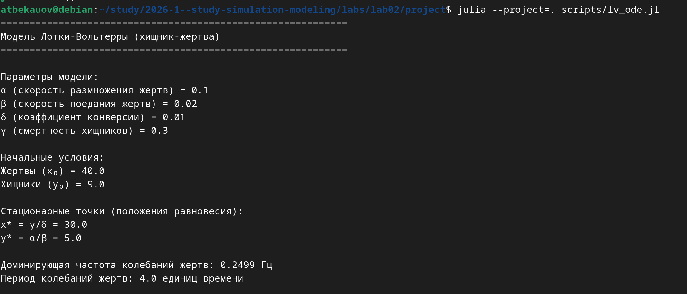
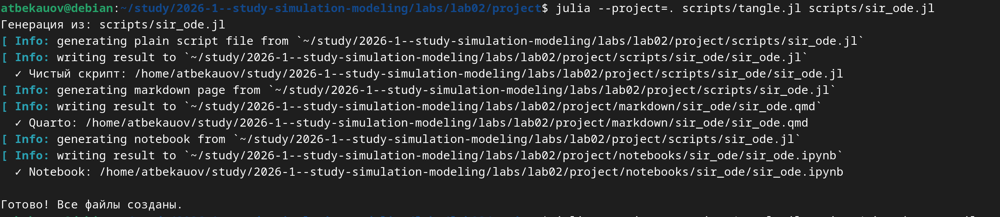
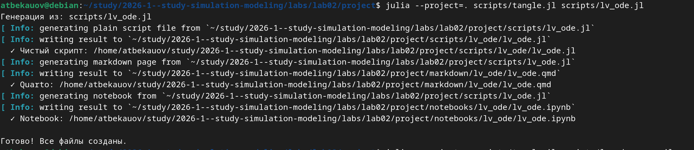
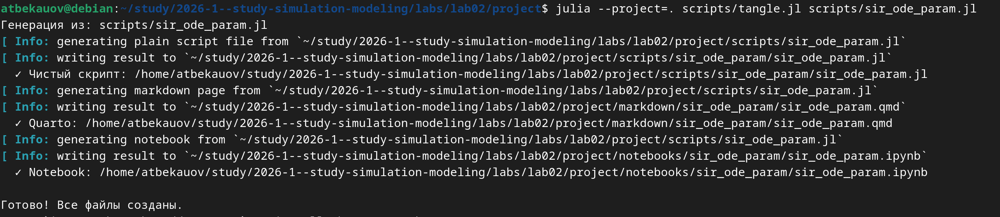
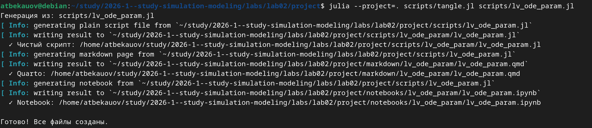

---
## Author
author:
  name: Бекауов Артур Тимурович
  email: 1132236049@rudn.ru
  
## Title
title: "Лабораторная работа №2: Модель SIR, Модель Лотки-Вольтерры"
subtitle: "Имитационное моделирование"
license: "CC BY"
---

# Цель работы

Изучить две модели: модель SIR и модель Лотки-Вольтерры

# Задание

1. Создать рабочий каталог для кода
2. Установить необходимые пакеты
3. Выполнить предложенный код
4. Преоборазовать код в литературный стиль
5. Сгенерировать из литературного кода производные форматы
6. Выполнить код из jupiter notebook
7. Интегрировать документацию в формате Quarto в отчёт
8. Добавить в код в литературном формате вычисление для набора параметров
9. Сгенерировать из литературного кода с параметрами производные форматы
10. Выполнить код из Jupyter notebook с параметрами
11. Интегрировать документацию с параметрами в формате Quarto в отчёт

# Теоретическое введение

Модель SIR есть классическая и фундаментальная математическая модель эпидемиологии, описывающая распространение инфекционного заболевания в закрытой популяции.

Модель Лотки-Вольтерры — это фундаментальная математическая модель в экологии, описывающая динамику взаимодействия двух видов: хищников и жертв. Она была независимо предложена в 1920-х годах:

Альфредом Лоткой (1925) для химических реакций.

Витторио Вольтеррой (1926) для объяснения колебаний улова рыбы в Адриатическом море.

Модель демонстрирует, как даже простая система взаимодействий может порождать сложные колебательные режимы, объясняя циклические изменения численности в природных экосистемах.

# Выполнение лабораторной работы

## Создание рабочего каталога проекта

Создаю рабочий каталог для проекта ([рис. @fig-001]).

{#fig-001 width=70%}

## Устанавить необходимые пакеты

Затем с помощью скрипта add_packages.jl устанавливаю необходимые пакеты ([рис. @fig-002]).

{#fig-002 width=70%}

## Выполнение кода

Выполняю скрипты sir_ode.jl, lv_ode.jl ([рис. @fig-003] и [рис. @fig-004]).

{#fig-003 width=70%}

{#fig-004 width=70%}

## Преобразовываю код в литературный стиль

Преобразовываю код sir_ode.jl и lv_ode.jl в литературный стиль (Можно посмотреть в конце отчёта)

## Создаю производные форматы

Из sir_ode.jl и lv_ode.jl создаю производные форматы: чистый код, документацию Quarto и Jupyter notebook ([рис. @fig-005] и [рис. @fig-006]).

{#fig-005 width=70%}

{#fig-006 width=70%}

## Выполнить Jupyter

Выполняю Jupyter блокноты

## Интеграция документации в отчёт

Интегрирую документацию в формате Quarto в отчёт.

## Добавить в код в литературном стиле вычисление для набора параметров.

Добавляю в код в литературном стиле вычисления для набора параметров, получая скрипты sir_ode_param.jl и lv_ode_param.jl (Можно ознакомится в конце отчёта)

## Сгенерировать из литературного кода с параметрами производные форматы

Из sir_ode_param.jl и lv_ode_param.jl создаю производные форматы: чистый код, документацию Quarto и Jupyter notebook ([рис. @fig-007] и [рис. @fig-008]).

{#fig-007 width=70%}

{#fig-008 width=70%}

## Выполнить код из Jupyter notebook с параметрами

Выполняю код из jupyter notebook с параметрами

## Интегрировать документацию в формате Quarto в отчёт

Интегрирую документацию в формате Quarto в отчёт.









# Выводы

В ходе лабораторной работы я изучил две модели: модель SIR и модель Лотки-Вольтерры.

# Список литературы{.unnumbered}

::: {#refs}

