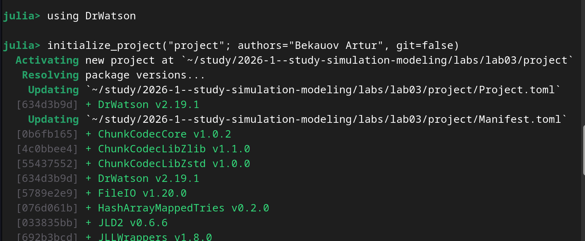
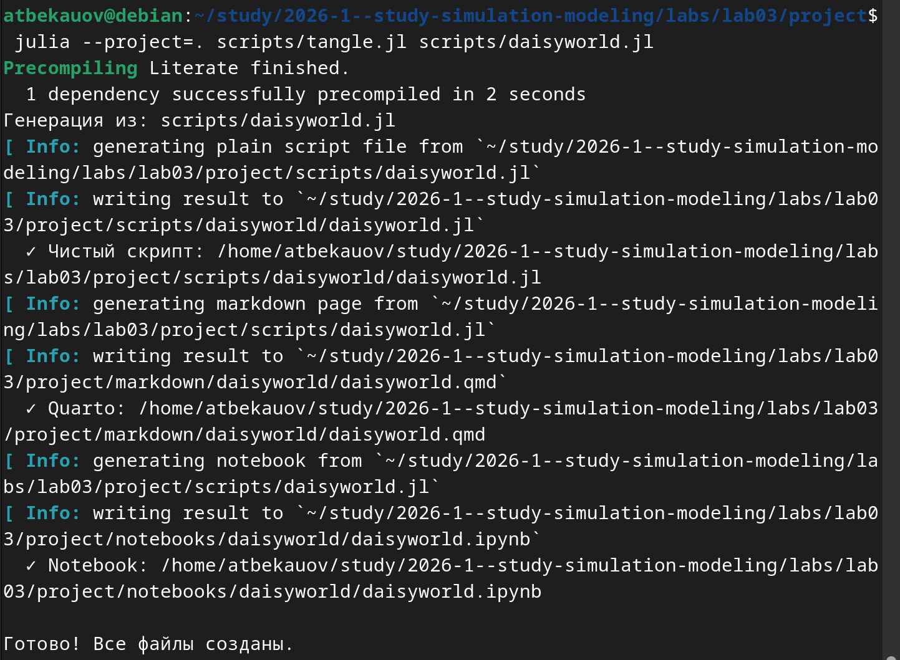
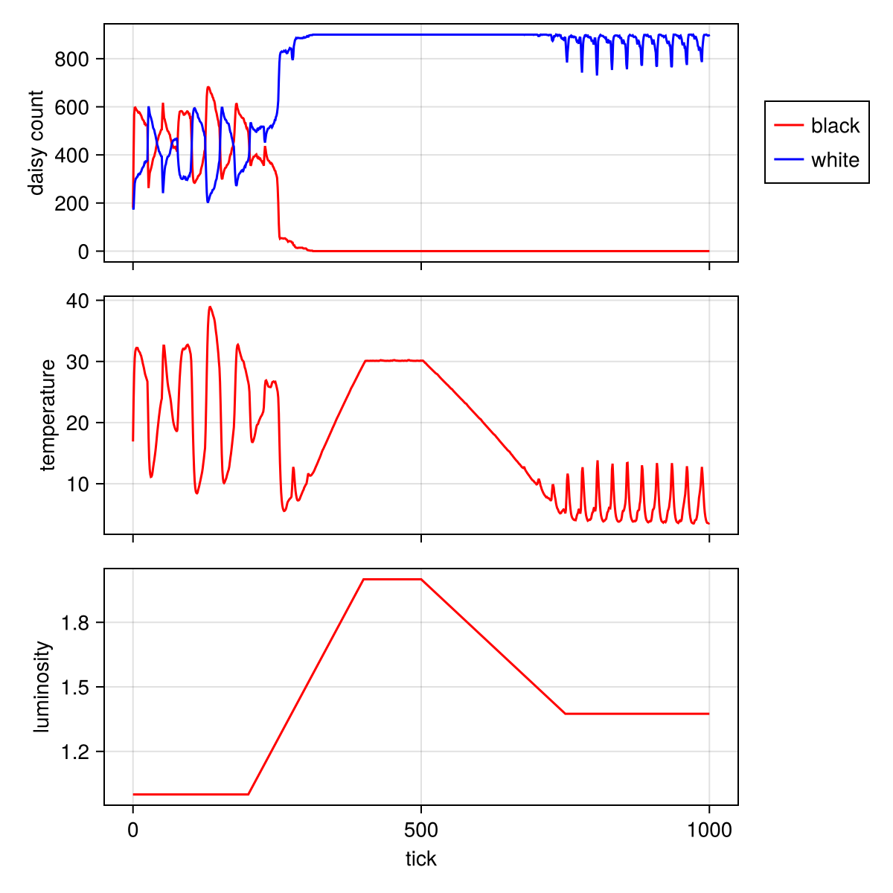

---
## Author
author:
  name: Бекауов Артур Тимурович
  email: 1132236049@rudn.ru
  
## Title
title: "Лабораторная работа №3"
subtitle: "Имитационное моделирование"
license: "CC BY"
---

# Цель работы

Изучить основы агентного моделирования на примере модели Daisyworld (Мир маргариток). Научиться создавать агентные модели с использованием пакета Agents.jl в Julia, проводить параметрические исследования и визуализировать результаты.

# Задание

1. Создать рабочий каталог для кода лабораторной работы.
2. Установить необходимые пакеты: DrWatson, Agents, DataFrames, CairoMakie, StatsBase.
3. Выполнить предложенные скрипты модели Daisyworld.
4. Преобразовать код в литературный стиль с использованием Literate.jl.
5. Сгенерировать из литературного кода чистый код, Jupyter Notebook и Quarto-документ.
6. Выполнить параметрическое исследование модели с различными значениями параметров.
7. Интегрировать полученные результаты в отчёт.

# Теоретическое введение

## Агентное моделирование

Агентное моделирование (Agent-Based Modeling, ABM) — это метод исследования сложных систем, в котором поведение системы возникает из взаимодействия множества автономных сущностей, называемых агентами. Вместо описания системы глобальными уравнениями, моделируется каждая индивидуальная единица и правила её поведения, а затем наблюдаются коллективные паттерны, появляющиеся снизу вверх.

## Модель Daisyworld

Модель Daisyworld, предложенная Джеймсом Лавлоком и Эндрю Уотсоном, иллюстрирует гипотезу Геи — идею о том, что планета является единой саморегулирующейся системой. В этой модели чёрные и белые маргаритки растут на клеточной сетке и влияют на локальную температуру через разное альбедо. Чёрные маргаритки поглощают больше тепла, белые — отражают. Температура влияет на вероятность размножения, а агенты стареют и умирают. Модель демонстрирует, как живые организмы могут регулировать условия окружающей среды.

# Выполнение лабораторной работы

## Настройка рабочего окружения

Перед началом работы был создан проект DrWatson и установлены необходимые пакеты: DrWatson, Agents, DataFrames, CairoMakie, StatsBase.

## Литературное программирование

Все скрипты модели были преобразованы в литературный стиль с использованием Literate.jl. Для каждого скрипта были сгенерированы чистый код, Jupyter Notebook и Quarto-документ.

## Визуализация модели

В ходе работы была построена комплексная динамика модели Daisyworld, показывающая изменение численности маргариток, температуры и светимости во времени.

На графике видно, что при увеличении светимости белые маргаритки (с высоким альбедо) начинают доминировать, охлаждая планету. При снижении светимости активизируются чёрные маргаритки, поглощающие больше тепла. Это демонстрирует способность системы к саморегуляции.

# Выводы

В ходе выполнения лабораторной работы были достигнуты следующие результаты:

1. Освоены основы агентного моделирования: изучена структура агентной модели (агенты, среда, взаимодействия), реализована модель Daisyworld с использованием Agents.jl.

2. Проведён анализ модели Daisyworld: исследована динамика численности чёрных и белых маргариток, изучено влияние маргариток на локальную температуру, проанализирована способность системы к саморегуляции.

3. Выполнено параметрическое исследование: изучено влияние максимального возраста и начального распределения видов на динамику популяции.

4. Освоены инструменты литературного программирования: преобразование кода в литературный стиль, генерация чистого кода, Jupyter Notebook и Quarto-документов.

Модель Daisyworld наглядно демонстрирует принципы саморегуляции сложных систем. При изменении внешних условий популяция маргариток адаптируется, поддерживая температуру в диапазоне, благоприятном для жизни.









 



# Список литературы{.unnumbered}

1. Д. С. Кулябов, А. В. Королькова. Имитационное моделирование. Практикум. — 2024.
2. Datseris G., Vahdati A. R., DuBois T. C. Agents.jl: a performant and feature-full agent-based modeling software of minimal code complexity // SIMULATION. — 2022.
3. Wood A. J. et al. Daisyworld: A review // Reviews of Geophysics. — 2008.
4. Watson A. J., Lovelock J. E. Biological homeostasis of the global environment: the parable of Daisyworld // Tellus B: Chemical and Physical Meteorology. — 1983.

