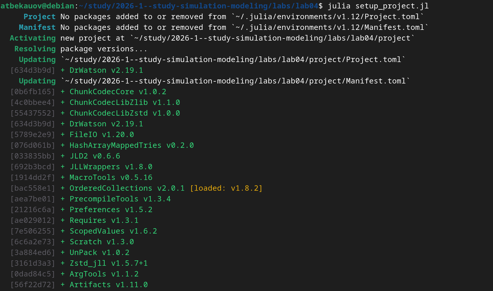
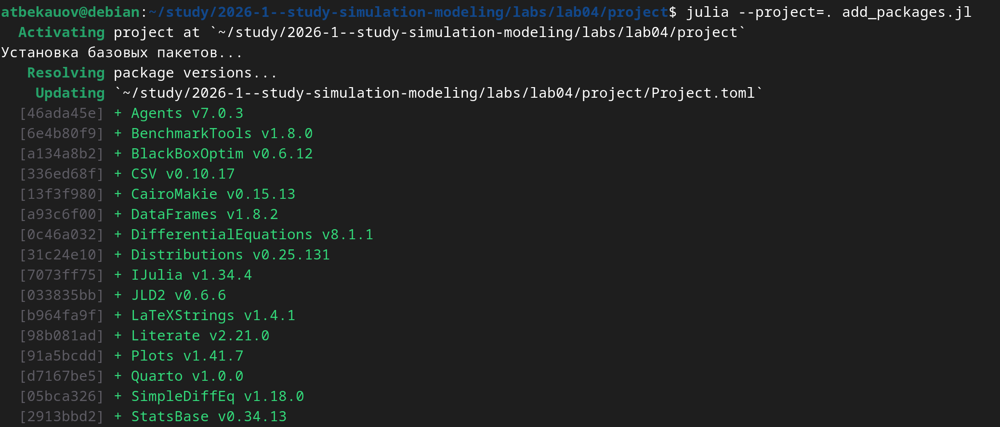
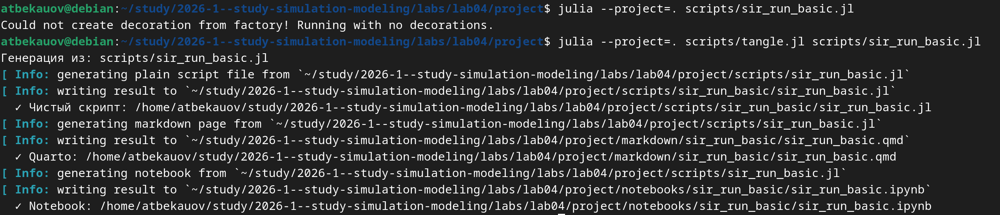

---
## Author
author:
  name: Бекауов Артур Тимурович
  email: 1132236049@rudn.ru
  
## Title
title: "Лабораторная работа №4"
subtitle: "Имитационное моделирование"
license: "CC BY"
---

# Цель работы

Изучить реализацию эпидемиологической модели SIR в агентном подходе с использованием пакета Agents.jl в Julia. Научится проходить параметрические исследования и анализировать динамику эпидемии

# Задание

1. Создать рабочий каталог для кода лабораторной работы.
2. Установить необходимые пакеты
3. Выполнить предложенные скрипты модели SIR
4. Преобразовать код в литературный стиль с использованием Literate.jl.
5. Сгенерировать из литературного кода чистый код, Jupyter Notebook и Quarto-документ.
6. Выполнить параметрическое исследование модели с различными значениями параметров.
7. Интегрировать полученные результаты в отчёт.

# Теоретическое введение

## Агентное моделирование

Агентное моделирование позволяет преодолеть ограничения классических моделей:

- Каждый индивид моделируется отдельно с уникальными характеристиками.
- Взаимодействия происходят локально в пространстве или социальной сети.
- Процессы носят стохастический характер.
- Можно учитывать гетерогенность контактов, мобильность, меры контроля.

## Модель SIR

Модель SIR, предложенная Кермаком и Маккендриком в 1927 году, описывает динамику эпидемии в популяции, разделённой на три группы:

- **S**(Susceptible) — восприимчивые к заболеванию индивиды;
- **I**(Infectious) — инфицированные, способные заражать восприимчивых;
- **R**(Recovered) — выздоровевшие (или умершие), получившие иммунитет и более не участвующие в распространении.

В агентной реализации каждый агент может мигрировать между городами, заражать других, выздоравливать и умирать.

# Выполнение лабораторной работы

## Настройка рабочего окружения

Перед началом работы был создан проект DrWatson и установлены необходимые пакеты: DrWatson, Agents, DataFrames, Plots, JLD2, BlackBoxOptim.

## Литературное программирование

Все скрипты модели были преобразованы в литературный стиль с использованием Literate.jl. Для каждого скрипта были сгенерированы чистый код, Jupyter Notebook и Quarto-документ.

## Базовый эксперимент

Запущен базовый эксперимент с параметрами по умолчанию: три города по 1000 человек, инфекция начинается в третьем городе.

На графике видна характерная SIR-динамика: восприимчивые убывают, инфицированные проходят через пик, выздоровевшие накапливаются.

## Сканирование коэффициента заразности β

Проведено исследование влияния β на динамику эпидемии. Диапазон от 0.1 до 1.0 с шагом 0.1. При β < 0.3 эпидемия не возникает. С ростом β пик заболеваемости и смертность увеличиваются.

## Исследование эффекта миграции

Исследовано влияние интенсивности миграции между городами. Чем выше интенсивность, тем быстрее инфекция распространяется, что приводит к более раннему и высокому пику.

## Многокритериальная оптимизация

С использованием алгоритма Borg MOEA найдены оптимальные параметры, минимизирующие пик заболеваемости и долю умерших. Оптимальные значения: β_und ≈ 0.35, время выявления ≈ 7 дней.

## Полное параметрическое сканирование

Выполнено сканирование по всем параметрам: β_und, detection_time, death_rate, infection_period, reinfection_probability. Анализ показал, что раннее выявление значительно снижает пик заболеваемости, а повторное заражение создаёт вторую волну.

# Выводы

В ходе выполнения лабораторной работы были достигнуты следующие результаты:

1. Реализована агентная модель SIR с механизмами миграции, передачи инфекции, выздоровления и смерти.

2. Проведён анализ базовой динамики, определён порог возникновения эпидемии при β ≈ 0.2.

3. Выполнено параметрическое исследование влияния β и миграции на динамику эпидемии.

4. Проведена многокритериальная оптимизация параметров.

5. Освоены инструменты литературного программирования.

Агентная модель SIR позволяет более реалистично моделировать распространение инфекций, учитывая индивидуальные особенности и пространственную структуру.













# Список литературы{.unnumbered}

1. Д. С. Кулябов, А. В. Королькова. Имитационное моделирование. Практикум. — 2024.
2. Datseris G., Vahdati A. R., DuBois T. C. Agents.jl: a performant and feature-full agent-based modeling software of minimal code complexity // SIMULATION. — 2022.

