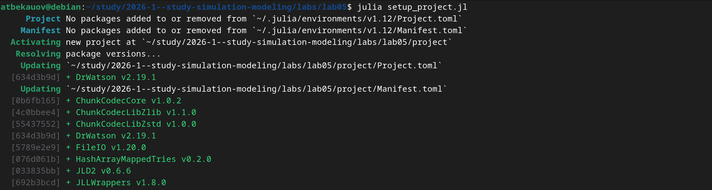
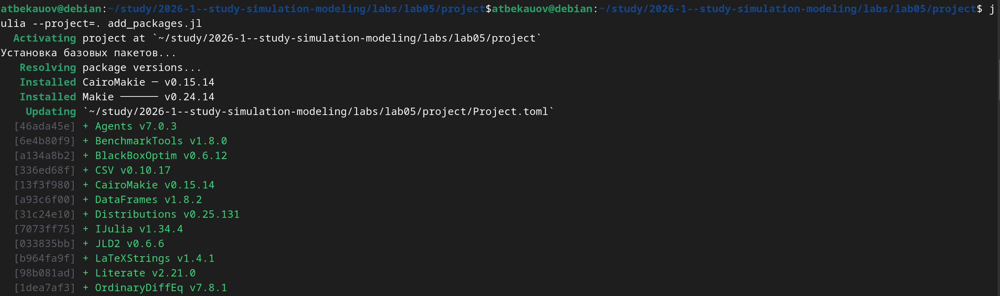
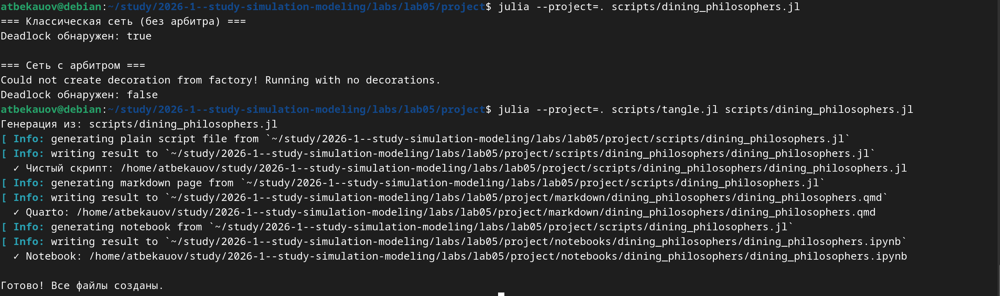
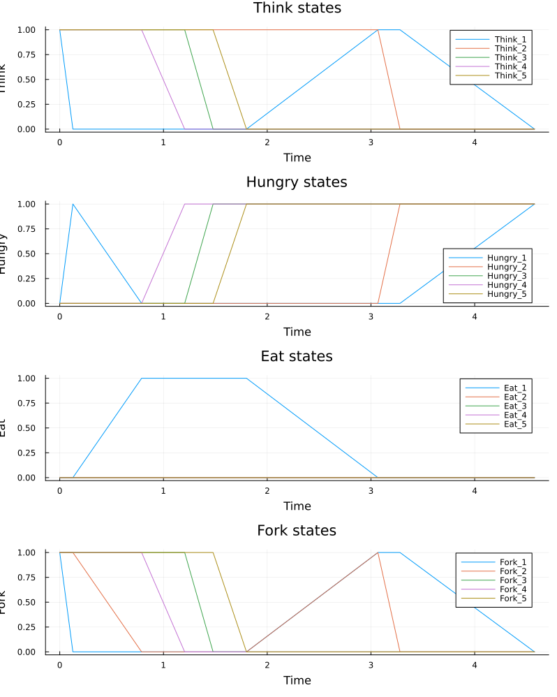
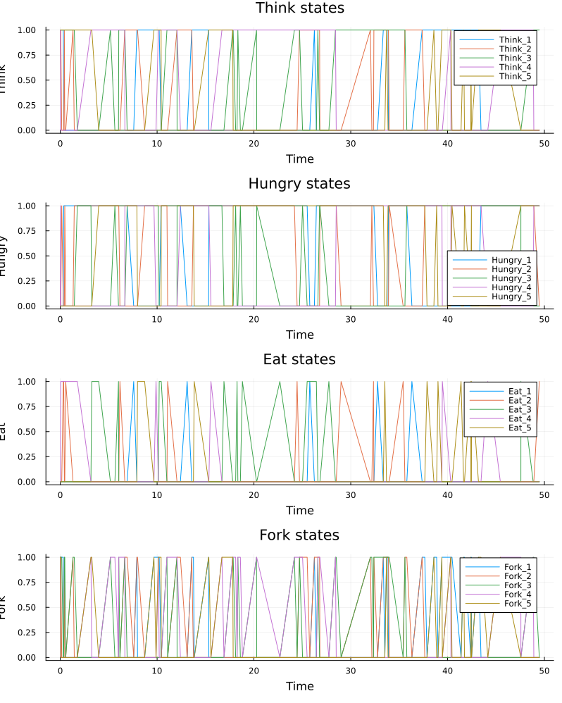

---
## Author
author:
  name: Бекауов Артур Тимурович
  degrees: student
  email: 1132236049@rudn.ru
  affiliation:
    - name: Российский университет дружбы народов
      country: Российская Федерация
      postal-code: 117198
      city: Москва
      address: ул. Миклухо-Маклая, д. 6
## Title
title: Лабораторная работа №5
subtitle: Аппарат сетей Петри
license: CC BY
date: today
date-format: "YYYY-MM-DD" # Example: 2025-09-06
---

# Информация

## Докладчик

:::::::::::::: {.columns align=center}
::: {.column width="70%"}

  * Бекауов Артур Тимурович
  * студент НФИбд-01-23
  * Российский университет дружбы народов им. П. Лумумбы
  * [1132236049@rudn.ru](mailto:1132236049@rudn.ru)

:::
::: {.column width="30%"}

:::
::::::::::::::

# Вводная часть

## Актуальность

- Параллельные и распределённые системы повсеместно используются в IT.

- Проблемы синхронизации (deadlock) критичны для надёжности систем

- Сети Петри представляют наглядный математический аппарат для моделирования

- Задача об обедающих философах - классическая иллюстрация проблемы взаимной блокировки

## Объект и предмет исследования

- **Объект:** Сети Петри как математический аппарат моделирования дискретных систем

- **Предмет:** проблема взаимной блокировки (deadlock) и способы её предотвращения в параллельных системах

## Цели и задачи

**Цель:** Изучить аппарат сетей петри на примере задачи об обедающих философах

**Задачи:**

1. Реализовать сети Петри для классической модели и модели с арбитром

2. Провести стахастическое моделирование динамики

3. Обнаружить deadlock в классической модели

4. Сравнить поведение двух моделей

5. Провести параметрическое исследование для разного числа философов

6. Оформить результаты исследования в виде отчёта и презентации

## Материалы и методы

- Язык программирования Julia

- Алгоритм Гиллеспи для стахастического моделирования

- Plots для визуализации

- Literate.jl для литературного программирования

# Содержание исследования

## Сети Петри

Двудольный ориентированный граф:

- **Позиции** (Places) -описывают состояние системы, содержат фишки

- **Переходы** (Transitions) - описывают события или действия системы.

- **Дуги** (Arcs) - соединения между позициями и переходами

- **Маркировка** (Marking) - распределение фишек по позициям

## Задача об ообедающих философах

- N философов сидят за круглым столом

- Между соседями лежит одна вилка

- Для еды нужны две вилки

- Проблема: при наивной релизации возникает взаимная блокировка

## Свойства сетей Петри

- **Ограниченность** - количество фишек не превышает предел K

- **Активность** - отсутствие вечных блокировок

- **Достижимость** - возможность попасть в заданную маркировку

- **Сохраняемость** - постоянство взвешенной суммы фишек

## Инициализация проекта

## Установка пакетов

## Литературное программирование

Все скрипты преобразованы в литературный стиль. Сгенерированы производные форматы

## Классическая модель (без арбитра)

Результаты:

- Через некоторое время все философы в состоянии Hungry

- Ни один переход не может сработать

- **Deadlock обнаружен**

## Модель с арбитром

Результаты:

- Арбитр содержит N-1 фишек

- Система работает бесконечно долго

- Философы поочерёдно получают доступ к вилкам

- **Deadlock не обнаружен**

## Анимация процесса

- Визуализация перемещения фишек

- Наглядно видно возникновение deadlock в классической модели

- Демонстрация работы механизма синхронизации

## Параметрическое исследование

Исследование для N ∈ {3, 5, 7}:

| N | tmax | Deadlock (классическая) | Deadlock (арбитр) |
|---|------|------------------------|-------------------|
| 3 | 30.0 | да                     | нет               |
| 5 | 50.0 | да                     | нет               |
| 7 | 70.0 | да                     | нет               |

**Вывод:** арбитр успешно предотвращает deadlock при любом числе философов.

## Сравнение с другими моделями

**Сети Петри vs Конечные автоматы:**

- Сети Петри естественно описывают параллелизм и синхронизацию

- Конечные автоматы — модель последовательного поведения

**Сети Петри vs Агентное моделирование:**

- Сети Петри — строгий математический аппарат для анализа

- Агентное моделирование — фокус на поведении индивидуальных сущностей

# Результаты

## Основные итоги

1. Реализованы сети Петри для задачи об обедающих философах

2. Обнаружена взаимная блокировка в классической постановке

3. Реализован механизм арбитра, предотвращающий deadlock

4. Проведено параметрическое исследование для разного числа философов

5. Создана анимация динамики сети

6. Освоены инструменты литературного программирования

## Демонстрация работы

- Графики сохраняются в каталог plots/

- Анимация сохраняется в GIF-формате

- Сгенерированы Jupyter Notebook и Quarto-документы

# Выводы

## Заключение

Сети Петри демонстрируют:

- Наглядное представление параллельных процессов

- Возможность обнаружения deadlock

- Эффективные механизмы синхронизации (арбитр)

- Применимость к реальным системам (БД, протоколы, производство)

**Главный вывод:** Сети Петри являются мощным инструментом для моделирования и анализа параллельных систем, позволяя выявлять и предотвращать проблемы синхронизации до их возникновения в реальном коде.

