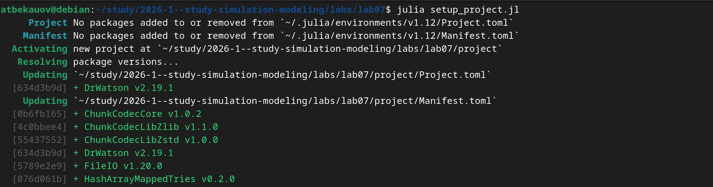
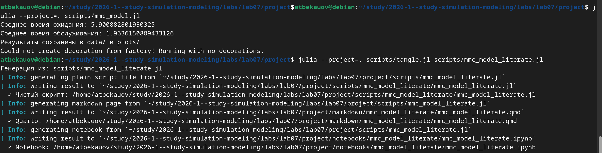

---
## Author
author:
  name: Бекауов Артур Тимурович
  degrees: student
  email: 1132236049@rudn.ru
  affiliation:
    - name: Российский университет дружбы народов
      country: Российская Федерация
      postal-code: 117198
      city: Москва
      address: ул. Миклухо-Маклая, д. 6
## Title
title: Лабораторная работа №7
subtitle: Дискретно-событийное моделирование
license: CC BY
date: today
date-format: "YYYY-MM-DD" # Example: 2025-09-06
---

# Информация

## Докладчик

:::::::::::::: {.columns align=center}
::: {.column width="70%"}

  * Бекауов Артур Тимурович
  * студент НФИбд-01-23
  * Российский университет дружбы народов им. П. Лумумбы
  * [1132236049@rudn.ru](mailto:1132236049@rudn.ru)

:::
::: {.column width="30%"}

:::
::::::::::::::

# Вводная часть

## Актуальность

- Системы массового обслуживания повсеместно встречаются в IT

- Колл-центры, веб-серверы, базы данных — всё это очереди

- Дискретно-событийное моделирование позволяет оценить производительность

- Модель Росса применяется для анализа надёжности систем с резервированием

## Объект и предмет исследования

- **Объект:** системы массового обслуживания

- **Предмет:** модель M/M/c и модель Росса (система с резервом и ремонтом)

## Цели и задачи

**Цель:** Освоить дискретно-событийное моделирование в Julia.

**Задачи:**
1. Реализовать модель M/M/c с использованием ConcurrentSim

2. Реализовать модель Росса

3. Провести параметрические исследования

4. Сравнить результаты с аналитическими формулами

5. Оформить результаты в виде отчёта и презентации

## Материалы и методы

- Язык программирования Julia

- ConcurrentSim + ResumableFunctions для DES

- StableRNGs для воспроизводимости

- Distributions для экспоненциальных распределений

- Plots для визуализации

- DrWatson для управления проектом

- Literate.jl для литературного программирования

# Содержание исследования

## Дискретно-событийное моделирование

- **Событие** - мгновенное изменение состояния системы, происходящее в конкретный модельный момент времени.

- **Состояние системы** - совокупность переменных, описывающих систему.

- **Модельное время** - переменная, хранящая текущее время модели.

- **Календарь событий** - упорядоченный список всех запланированных событий

## Модель M/M/c

По классификации Кендалла:

- **M** — пуассоновский входящий поток, интервалы ~ Exp(1/λ)

- **M** — время обслуживания ~ Exp(1/μ)

- **c** — количество параллельных каналов

Загрузка системы на один канал: ρ = λ / (c·μ)

Условие стационарности: ρ < 1

## Модель Росса

- N работающих машин, S запасных

- R ремонтников

- Отказ → замена из резерва → ремонт → возврат в резерв

- Нет резерва → система падает

- Цель: оценить среднее время E[T] до падения

## Инициализация проекта

## Установка пакетов.

## Литературное программирование

Все скрипты в литературном стиле. Сгенерированы:

- Чистый код

- Jupyter Notebook

- Quarto-документы

## Выполнение кода и создание форматов

## Базовая модель M/M/2

- λ = 0.9, μ = 0.5, 2 канала

- 1000 заявок

- Гистограммы времени ожидания и обслуживания

- Динамика среднего времени ожидания

- Зависимость ожидания от времени прибытия

## Графики базовой модели

## Параметрическое исследование M/M/c

5 конфигураций с разными λ, μ, c:

| Конфигурация | ρ |
|-------------|-----|
| M/M/1 | 1.0 |
| M/M/2 | 0.5 |
| M/M/2 | 0.9 |
| M/M/3 | 0.6 |
| M/M/4 | 0.75 |

## Результаты параметрического исследования

## Результаты M/M/c

- При ρ ≥ 1 система нестационарна

- Увеличение числа каналов снижает время ожидания

- Симуляция согласуется с формулой Эрланга

- Точки на графике «аналитика vs симуляция» лежат на диагонали

## Базовая модель Росса

- N = {5, 10, 20, 30}

- S = 3, R = 2

- λ = 100, μ = 1

- 10 прогонов для каждого N

## Графики базовой модели

## Параметрическое исследование Росса

7 конфигураций:

| Конфигурация | N | S | R |
|-------------|---|---|---|
| S=1, R=1 | 10 | 1 | 1 |
| S=3, R=1 | 10 | 3 | 1 |
| S=5, R=1 | 10 | 5 | 1 |
| S=3, R=2 | 10 | 3 | 2 |
| S=3, R=3 | 10 | 3 | 3 |
| N=5, S=2 | 5 | 2 | 1 |
| N=15, S=5 | 15 | 5 | 1 |

## Результаты параметрического исследования

## Результаты модели Росса

- Увеличение резерва S значительно повышает время до падения

- Добавление ремонтников тоже помогает, но меньше

- При малом N система живёт дольше

- Аналитическая оценка близка к симуляции

# Результаты

## Основные итоги

1. Реализована модель M/M/c с визуализацией

2. Реализована модель Росса с мониторингом очереди

3. Проведены параметрические исследования

4. Результаты согласуются с аналитикой

5. Освоены ConcurrentSim и корутины Julia

6. Освоено литературное программирование

