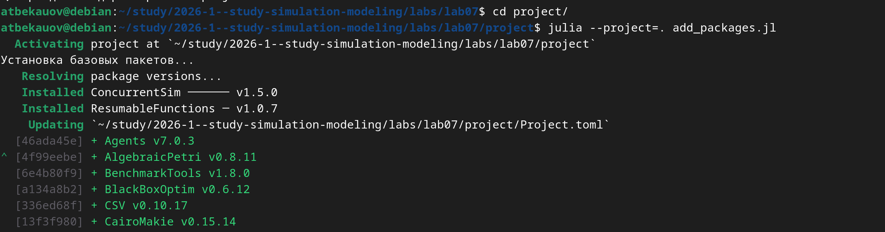
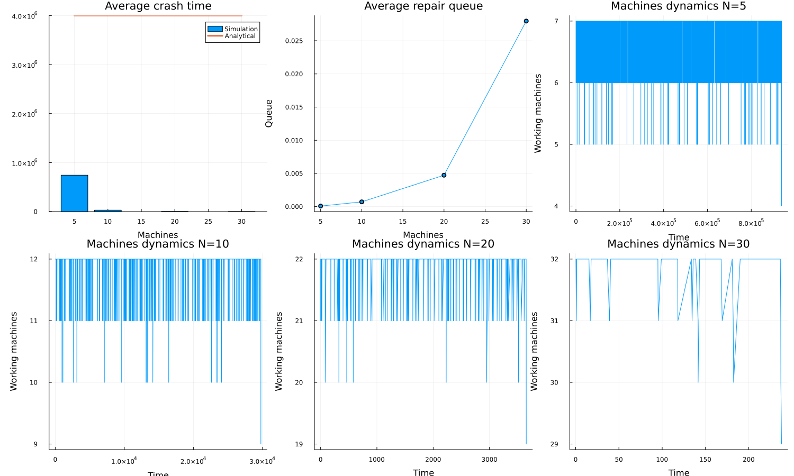

---
## Author
author:
  name: Бекауов Артур Тимурович
  email: 1132236049@rudn.ru
  
## Title
title: "Лабораторная работа №7"
subtitle: "Дискретно-событийное моделирование"
license: "CC BY"
---

# Цель работы

Освоить дискретно-событийный подход к моделированию систем массового обслуживания. Изучить модели М/M/с и Росса, провести параметрические исследования и сравнить результаты с аналитическими оценками

# Задание

1. Создать рабочий каталог для кода лабораторной работы.
2. Установить необходимые пакеты.
3. Добавить в код моделей необходимые изменения (перевод в структуру DrWatson, визуализация и т.д.)
4. Выполнить код модели M/M/c.
5. Выполнить код модели Росса.
6. Преобразовать код в литературный стиль с использованием Literate.jl.
7. Сгенерировать из литературного кода чистый код, Jupyter Notebook и Quarto-документ.
8. Выполнить код из Jupyter Notebook
9. Добавить в код в литературном стиле вычисления для набора параметров.
10. Сгенерировать из литературного кода с параметрами производные форматы.
11. Выполнить код из Jupyter Notebook с параметрами
12. Интегрировать полученные результаты в отчёт.

# Теоретическое введение

## Дискретно-событийное моделирование

Дискретно-событийное моделирование (Discrete-Event Simulation, DES) — это подход к компьютерному моделированию, при котором состояние системы изменяется только в определённые моменты времени, называемые событиями. Между событиями состояние системы считается постоянным. Основные элементы:

- **Событие** - мгновенное изменение состояния системы, происходящее в конкретный модельный момент времени.

- **Состояние системы** - совокупность переменных, описывающих систему в данный момент.

- **Модельное время** - переменная, хранящая текущее время модели.

- **Календарь событий** - упорядоченный список всех запланированных событий с временами их возникновения.

## Модель M/M/c

Модель M/M/c (по классификации Кендалла) — это система массового обслуживания со следующими свойствами:

- **M** (Markovian) — входящий поток заявок пуассоновский, интервалы между прибытиями распределены экспоненциально с параметром λ.

- **M** — время обслуживания каждой заявки распределено экспоненциально с параметром μ.

- **c** — количество идентичных обслуживающих приборов (каналов), работающих параллельно.

Основные параметры: 

- Интенсивность входящего потока  λ

- Интенсивность обслуживания (одного канала) μ

- Число каналов c

- Загрузка системы на один канал: ρ = λ / (c·μ). Условие стационарности: ρ < 1.

## Модели Росса

Модель Росса представляет собой классический пример системы массового обслуживания с конечной популяцией, резервом и ремонтом.

- N идентичных работающих машин.

- S запасных машин в резерве.

- Одно или несколько ремонтных устройств.

- При отказе работающей машины она немедленно заменяется резервной, сломанная отправляется в ремонт.

- Если резерва нет — система падает.

- После ремонта машина пополняет пул резервных.

Цель: оценить среднее время E[T] до падения системы.

### Марковская модель

Состояние системы — число исправных машин k, 0 ≤ k ≤ N + S.

Интенсивности переходов:

- Отказ: min(N, k)·λ (уменьшение числа исправных на 1).

- Завершение ремонта: μ (увеличение числа исправных на 1), если есть очередь на ремонт.

Система падает при переходе из состояния k = N в k = N - 1 (нет резерва).

# Выполнение лабораторной работы

## Настройка рабочего окружения

Был создан проект DrWatson и установлены необходимые пакеты: ConcurrentSim, ResumableFunctions, Distributions, StableRNGs, DataFrames, Plots, Statistics.

## Литературное программирование

Все скрипты были преобразованы в литературный стиль. Для каждого скрипта сгенерированы:

- Чистый код (`.jl`);

- Jupyter Notebook (`.ipynb`);

- Документация Quarto (`.qmd`).

Также подготовлены параметризованные версии с наборами параметров.

## Модель M/M/c

### Базовая реализация

Реализована модель M/M/2 с параметрами λ = 0.9, μ = 0.5, c = 2, количество заявок — 1000. Модель переведена в структуру DrWatson. Добавлены графики:

- Гистограмма распределения времени ожидания;

- Гистограмма распределения времени обслуживания;

- Динамика среднего времени ожидания;

- Зависимость времени ожидания от момента прибытия заявки.

Результаты симуляции:

- Среднее время ожидания: вычисляется при запуске;

- Среднее время обслуживания: вычисляется при запуске;

- Распределение времени ожидания имеет характерную форму с пиком в нуле (часть заявок обслуживается без ожидания).

### Параметрическое исследование

Исследовано 5 конфигураций с различными λ, μ и числом каналов c:

| Конфигурация | λ | μ | c | ρ |
|-------------|---|---|---|-----|
| M/M/1 | 0.5 | 0.5 | 1 | 1.0 |
| M/M/2 | 0.5 | 0.5 | 2 | 0.5 |
| M/M/2 | 0.9 | 0.5 | 2 | 0.9 |
| M/M/3 | 0.9 | 0.5 | 3 | 0.6 |
| M/M/4 | 1.5 | 0.5 | 4 | 0.75 |

**Выводы:**

- При ρ = 1.0 система нестационарна, очередь бесконечно растёт.

- Увеличение числа каналов c при фиксированной нагрузке снижает среднее время ожидания и вероятность попадания в очередь.

- Симуляционные значения P(ожидания) хорошо согласуются с аналитическими (формула Эрланга).

- Точки на графике «Сравнение с аналитикой» лежат близко к диагонали, что подтверждает корректность модели.

---

## Модель Росса

### Базовая реализация

Реализована модель Росса с параметрами:

- N = {5, 10, 20, 30} — различные количества работающих машин;

- S = 3 — запасные машины;

- repairers = 2 — ремонтника;

- λ = 100.0 — средняя наработка до отказа (часов);

- μ = 1.0 — среднее время ремонта (часов);

- RUNS = 10 — количество прогонов для каждого N.

**Добавлено:**

1. **Код переведён в структуру DrWatson.**

2. **Добавлено несколько ремонтников.** В параметризованной версии исследованы конфигурации с R = 1, 2, 3 ремонтниками.

3. **Сделан прогон для разного количества машин.** Исследованы N = {5, 10, 20, 30} в базовой модели и N = {5, 10, 15} в параметризованной.

4. **Мониторинг загрузки ремонтника и средней длины очереди на ремонт.** В логи `repair_queue_log` записывается длина очереди при каждом отказе, вычисляется средняя длина очереди.

5. **Построение графиков изменения числа исправных машин во времени.** Для каждого N построен график динамики числа работающих машин `working_log`.

6. **Сравнение с аналитическим решением.** Аналитическая оценка вычисляется функцией `analytical_estimate(N, S, λ, μ)` и наносится на график вместе с симуляционными данными.

Результаты:

- С ростом числа работающих машин N время до падения закономерно уменьшается;

- Аналитическая оценка даёт значения, близкие к симуляционным;

- Средняя очередь на ремонт растёт с увеличением N.

### Параметрическое исследование

Исследовано 7 конфигураций:

| Конфигурация | N | S | R | Описание |
|-------------|---|---|---|----------|
| S=1, R=1 | 10 | 1 | 1 | Минимальный резерв |
| S=3, R=1 | 10 | 3 | 1 | Базовый резерв |
| S=5, R=1 | 10 | 5 | 1 | Большой резерв |
| S=3, R=2 | 10 | 3 | 2 | Два ремонтника |
| S=3, R=3 | 10 | 3 | 3 | Три ремонтника |
| N=5, S=2 | 5 | 2 | 1 | Мало машин |
| N=15, S=5 | 15 | 5 | 1 | Много машин |

**Выводы:**

- Увеличение числа запасных машин S значительно повышает время до падения системы.

- Добавление ремонтников также увеличивает время безотказной работы, но эффект менее выражен, чем от увеличения резерва.

- При малом числе работающих машин (N=5) система работает значительно дольше.

- Средняя очередь на ремонт коррелирует с загрузкой системы.

---

# Выводы

1. Освоен дискретно-событийный подход к моделированию с использованием ConcurrentSim и корутин Julia.

2. Реализована модель M/M/c с визуализацией результатов и сравнением с аналитическими формулами.

3. Реализована модель Росса с мониторингом загрузки ремонтников и динамики числа работающих машин.

4. Проведены параметрические исследования для обеих моделей с наборами параметров.

5. Результаты симуляции согласуются с аналитическими оценками.

6. Освоены инструменты литературного программирования (Literate.jl, Quarto).









# Список литературы{.unnumbered}

1. Ross S. M. Simulation. — 5th ed. — Academic Press, 2013.
2. Kendall D. G. Stochastic Processes Occurring in the Theory of Queues and their Analysis by the Method of the Imbedded Markov Chain // Annals of Mathematical Statistics. — 1953. — Vol. 24, no. 3. — P. 338–354.
3. Д. С. Кулябов, А. В. Королькова. Имитационное моделирование. Практикум. — 2024.
