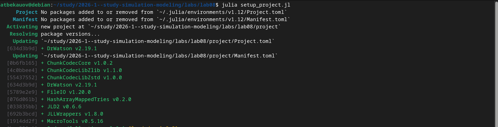
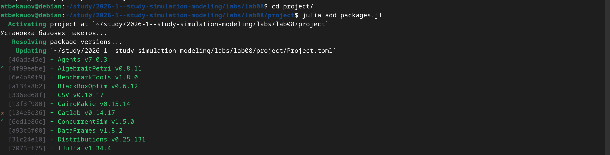
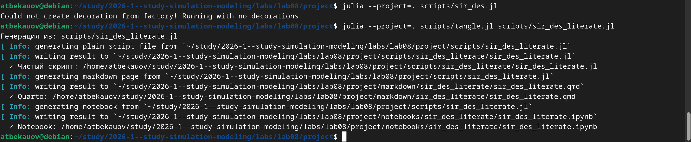
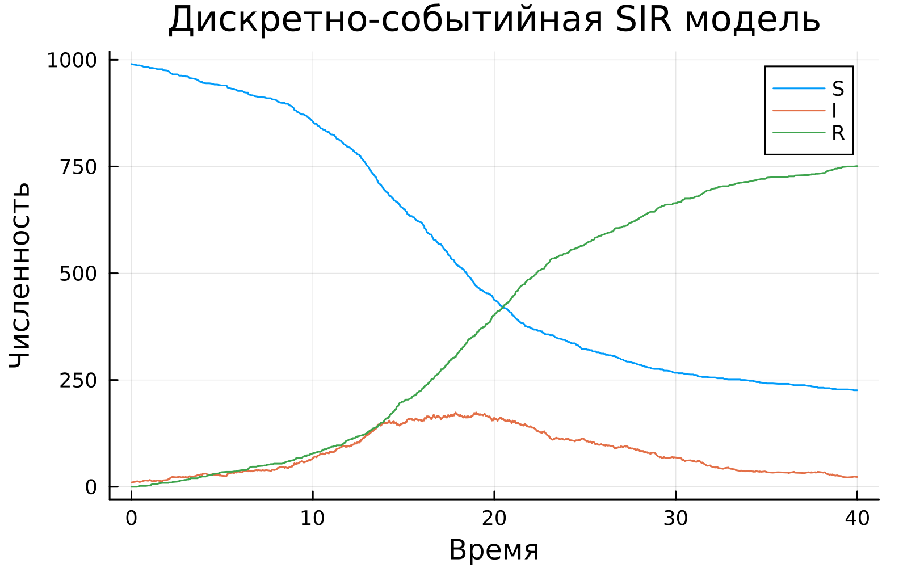
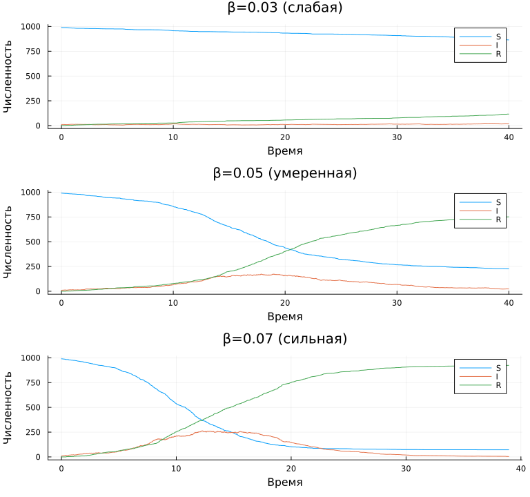

---
## Author
author:
  name: Бекауов Артур Тимурович
  email: 1132236049@rudn.ru
  
## Title
title: "Лабораторная работа №8"
subtitle: "Реализация основных моделей в дискретно-событийном подходе"
license: "CC BY"
---

# Цель работы

Изучить дискретно-событийный подход к имитационному моделированию на примере классической модели распространения инфекции SIR. Реализовать стохастическую дискретно-событийную модель в виде программного комплекса на языке Julia.

# Задание

1. Создать рабочий каталог для кода лабораторной работы.
2. Установить необходимые пакеты
3. Выполнить предложенный код модели SIR в дискретно-событийном подходе
4. Преобразовать код в литературный стиль с использованием Literate.jl.
5. Сгенерировать из литературного кода чистый код, Jupyter Notebook и Quarto-документ.
6. Выполнить параметрическое исследование модели с различными значениями параметров.
7. Интегрировать полученные результаты в отчёт.

# Теоретическое введение

## Дискретно-событийное моделирование

Дискретно-событийное моделирование (Discrete-Event Simulation, DES) — это подход к компьютерному моделированию, при котором состояние системы изменяется только в определённые моменты времени, называемые событиями. Между событиями состояние системы считается постоянным. Основные элементы:

- **Событие** - мгновенное изменение состояния системы, происходящее в конкретный модельный момент времени.

- **Состояние системы** - совокупность переменных, описывающих систему в данный момент.

- **Модельное время** - переменная, хранящая текущее время модели.

- **Календарь событий** - упорядоченный список всех запланированных событий с временами их возникновения.

## Модели SIR

Модель SIR, предложенная Кермаком и Маккендриком в 1927 году, описывает динамику эпидемии в популяции, разделённой на три группы:

- **S**(Susceptible) — восприимчивые к заболеванию индивиды;

- **I**(Infectious) — инфицированные, способные заражать восприимчивых;

- **R**(Recovered) — выздоровевшие (или умершие), получившие иммунитет и более не участвующие в распространении.

## Дискретно-событийная релизация SIR

В отличие от детерминированной модели (система ОДУ) и стохастической модели Гиллеспи (популяционный уровень), в дискретно-событийной реализации каждый индивид моделируется как отдельный агент со своим жизненным циклом:

- Восприимчивый индивид ожидает случайное время до следующего контакта (∼ Exp(1/c)).

- Выбирает случайного собеседника из популяции.

- Если собеседник инфицирован, с вероятностью β происходит заражение.

- Инфицированный ожидает время до выздоровления (∼ Exp(1/γ)), после чего переходит в R.

Такой подход позволяет наблюдать случайные флуктуации и эффекты, связанные с конечным размером популяции.

# Выполнение лабораторной работы

## Настройка рабочего окружения

Был создан проект DrWatson и установлены необходимые пакеты.

## Литературное программирование

Сначала все скрипты были выполнены через терминал, а затем были преобразованы в литературный стиль. Для каждого скрипта сгенерированы чистый код, Jupyter Notebook и Quarto-документ.

## Базовый эксперимент:

Запущена модель SIR с параметрами β = 0.5 (коэффициент заражения); γ = 0.25 (коэффициент выздоровления); с = 10.0 (количество контактов в единицу времени) ; Начальная маркировка сети Петри: S₀ = 990, I₀ = 10, R₀ = 0; tmax = 40.0 (время симуляции)

На графике видна классическая динамика эпидемии: снижение S, рост I до пика с последующим спадом, монотонный рост R. В отличии от детерминированной модели наблюдаются стахстические флуктуации, характерные для агентного подхода.

## Параметрическое исследование

Исследовано влияние параметра β (вероятность заражения). Три сценария:

- β = 0.03 (слабая эпидемия)

- β = 0.05 (умеренная эпидемия)

- β = 0.07 (сильная эпидемия)

Результаты показывают, что с ростом β:

- Пик заболеваемости увеличивается.

- Конечное число переболевших растёт.

- При малом β эпидемия может не развиться из-за стохастических эффектов.

# Выводы

В ходе выполнения лабораторной работы были достигнуты следующие результаты:

1. Реализована дискретно-событийная модель SIR с использованием ConcurrentSim и корутин Julia.

2. Модель воспроизводит классическую динамику эпидимии со стохастическими флуктуациями.

3. Параметрическое исследование показало, что увеличение β приводит к более тяжелому течению эпидемии.

4. Дискретно-событийный подход позволяет моделировать поведение агентов, что даёт более детальную картину по с сравнению с популяционными моделями

5. Освоены инструменты литературного программирования в Julia (Literate.jl, Quarto).





# Список литературы{.unnumbered}

1. Kermack W. O., McKendrick A. G. A Contribution to the Mathematical Theory of Epidemics // Proceedings of the Royal Society A. — 1927. — Vol. 115, no. 772. — P. 700–721.
2. Gillespie D. T. Exact Stochastic Simulation of Coupled Chemical Reactions // The Journal of Physical Chemistry. — 1977. — Vol. 81, no. 25. — P. 2340–2361.
3. Д. С. Кулябов, А. В. Королькова. Имитационное моделирование. Практикум. — 2024.
4. Petri C. A. Kommunikation mit Automaten. — Bonn: Institut für Instrumentelle Mathematik, 1962.

